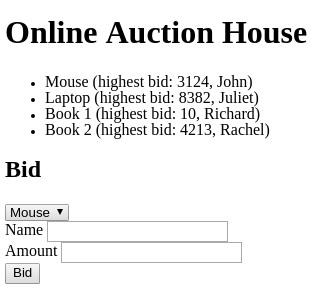
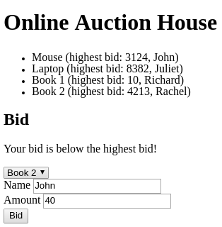
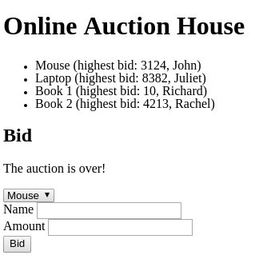

# Full-Stack Auction exam

We are going to create a web-based auction application.

**Read the whole description in order to understand the application.**

## Database

- Create a databased named *auction*

- Add auction items to the database

- It's expected that there is always at least one auction item in the database
  and all auction items got at least one bid

- Save your database related work into [this placeholder file](schema.sql) (this file is intentionally empty)

## GET `/`

- The main page should be rendered

- It must contain a list of all auctions (even the expired ones)

- It must display the title, the highest bid and the bidder's name

- It must contain a form with

  - a drop-down menu which contains all the auctions
  - a text field for the bidder's name
  - a text field for the amount
  - a submit button with the `bid`

- You should use the GET `/api/items` endpoint to display the auction items in
  the list and in the drop-down menu

- The form should be submitted to POST `/api/items/:id/bids`

- Update the DOM based on the response

  - If the bid is less than or equal to the highest bid display the message and
    do not clear the input fields

  - If the auction is over display the message and clear the input fields

  - If it was successful refresh the list of auctions and clear the input fields

### Main Page



#### Message



### Over



## POST `/api/items/:id/bids`

### Request

- The request body must contain the following JSON format

  ```json
  {
    "name": "John",
    "amount": 214
  }
  ```

### Response

- If the bid is less than or equal to the highest bid respond with the following
  JSON format

  ```json
  {
    "message": "Your bid is below the highest bid!"
  }
  ```

- If the auction is over respond with the following JSON format

  ```json
  {
    "message": "The auction is over!"
  }
  ```

- Else store the bid in the database and respond with the following JSON format

  ```json
  {
    "message": "Successful!"
  }
  ```

## GET `/api/items`

- It should respond with the stored auction items in the following JSON format

- The `expiryDate`'s format can be different but must include the year, month,
  day, hour and minute

```json
[
  {
    "id": 4,
    "itemName": "Book 2",
    "expiryDate": "2018-03-04T23:12:123",
    "highestBid": 4213,
    "highestBidderName": "Rachel"
  }
]
```

## Question

Given the following table named `carsForSale`

| carForSaleID | manufacturerName | modelName | acquisitionPrice | dataAcquired |
|:------------:|:----------------:|:---------:|:----------------:|:------------:|
|      1       |    Volkswagen    |   Jetta   |      13300       |  2007-01-07  |
|      2       |     Renault      |  Laguna   |      14700       |  2007-02-12  |
|      3       |       Ford       |   Focus   |      13600       |  2007-03-09  |
|      4       |      Daewoo      |   Tico    |       1100       |  2007-04-17  |
|      5       |      Toyota      |  Avensis  |      14500       |  2007-05-04  |
|      6       |    Alfa Romeo    |    156    |       8700       |  2007-06-23  |
|      7       |    Volkswagen    |  Passat   |      22000       |  2007-07-16  |
|      8       |     Renault      |   Clio    |       6400       |  2007-08-22  |
|      9       |       Ford       |  Fiesta   |       6900       |  2007-09-11  |
|      10      |      Daewoo      |   Cielo   |       3600       |  2007-10-18  |
|      11      |      Toyota      |   Rav4    |      24900       |  2007-11-11  |
|      12      |    Alfa Romeo    |    147    |       7500       |  2007-12-25  |
|      13      |    Volkswaen     |   Golf    |      16700       |  2008-01-14  |
|      14      |     Renault      |  Megane   |      11400       |  2008-02-24  |
|      15      |       Ford       |  Mondeo   |      14600       |  2008-03-18  |
|      16      |      Daewoo      |   Matiz   |       1700       |  2008-04-08  |
|      17      |      Toyota      |   Yaris   |       7400       |  2008-05-02  |
|      18      |    Alfa Romeo    |    159    |      17000       |  2008-06-12  |
|      19      |    Volkswagen    |   Polo    |       6500       |  2008-07-30  |
|      20      |     Renault      |  Scenic   |       6800       |  2008-08-11  |
|      21      |       Ford       |  Escort   |       2000       |  2008-09-22  |
|      22      |      Daewoo      |  Espero   |       2500       |  2008-10-09  |
|      23      |      Toyota      |  Corolla  |      103000      |  2008-11-05  |
|      24      |    Alfa Romeo    |    166    |       5200       |  2008-12-24  |

- Write an SQL query to get all `Renault` cars which are more expensive than
  8000

- Write an SQL query to decrease all `Volkswagen` car's price by 100 units
